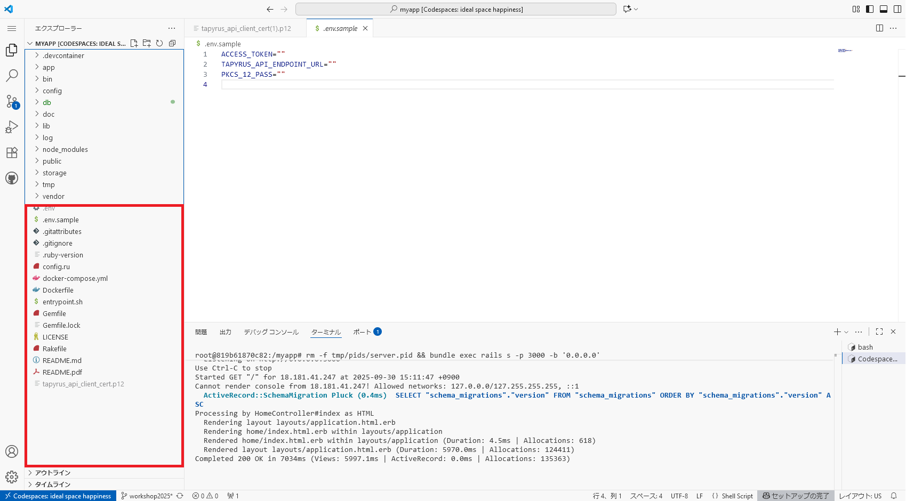
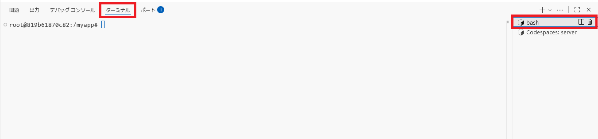
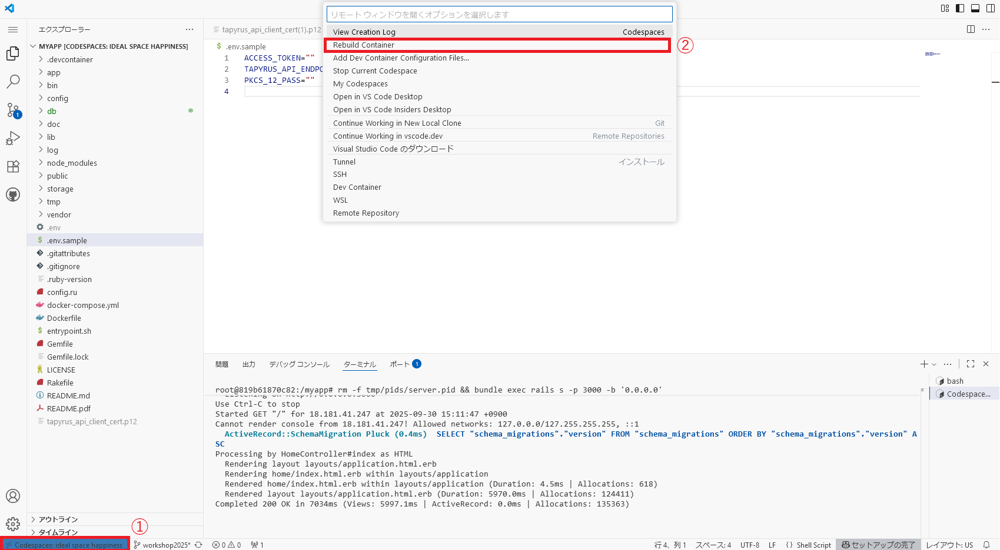
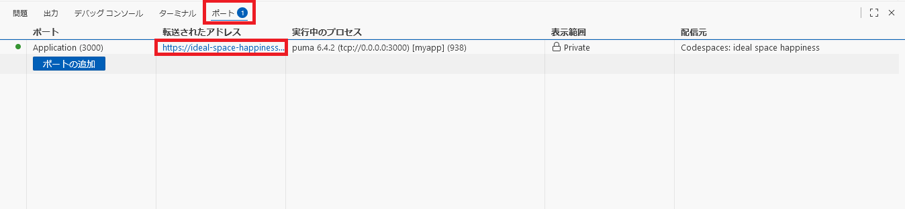

# README

ワークショップで用いるサンプルコード

# 起動手順

## 1. Codespacesを起動する

### 1.1.リポジトリページの右上にある緑色の 「Code」 ボタンをクリックします。

### 1.2.「Codespaces」 タブに切り替えて、「Create codespace on main」 をクリックします。

少し時間がかかります。


## 2. TapyrusAPI の準備

クライアント証明書のPKCS12ファイルを配置します。
階層は以下のようになります。

```
- myapp
|-- app
|-- bin
|-- config
....
|-- tapyrus_api_client_cert.p12
```
### 2.1. クライアント証明書

Google ドライブで共有する `tapyrus_api_client_cert.p12` を `myapp` ディレクトリに置きます。

ダウンロードしたクライアント証明書を赤枠の部分にドラッグ&ドロップします。


TapyrusAPI のクライアント証明書は API 利用のための認証情報になります。

### 2.2. アクセストークン, TapyrusAPI エンドポイント, クライアント証明書のパスフレーズ
画面下部のターミナルで以下のコマンドを実行し、設定ファイルを作成します。

```bash
cp .env.sample .env
```


**※ 注意点：bashとcodespaces:serverというターミナルが開くが、bashと書かれている方で実行すること。**


`.env`ファイルを編集します。  
アクセストークン, TapyrusAPI エンドポイント, クライアント証明書のパスフレーズはハンズオン時にお伝えします。  

### 2.3. 設定したファイルを読み込ませる
左下の「Codespaces: ...」と書かれた青い部分をクリックして、codespaces: Rebuild Containerを選択する。


青色のRebuildボタンを押す。
再ビルドされ設定ファイルが読み込まれます。

## 3. Web App を起動する

画面下部の「ポート」にてサーバーが起動しているので、「転送されたアドレス」をクリックしてURLにアクセスする。


# ワーク

1. [Work1 スクリプトの作成](doc/work1.md)
1. [Work2 ウェブアプリの作成](doc/work2.md)
